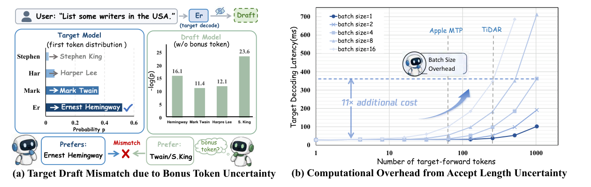
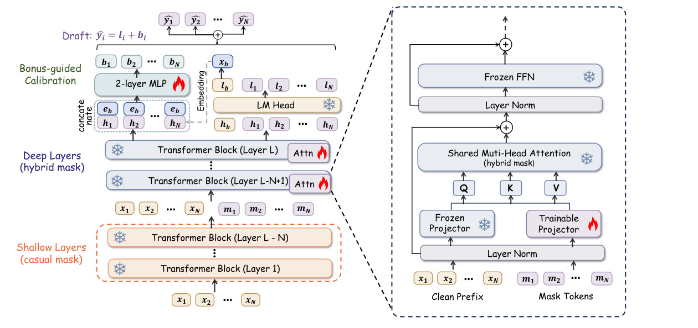
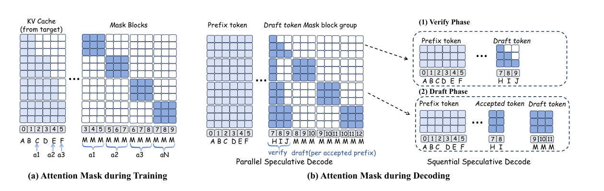

<div align="center">

# FlexDraft: Flexible Speculative Decoding via Attention Tuning and Bonus-Guided Calibration

[](https://arxiv.org/pdf/2605.20022)

</div>

Official inference release for **[FlexDraft: Flexible Speculative Decoding via Attention Tuning and Bonus-Guided Calibration](https://arxiv.org/pdf/2605.20022)**.

FlexDraft is a lossless speculative decoding framework for accelerating memory-bound LLM inference. It combines lightweight block diffusion drafting, bonus-guided calibration, and adaptive verification to improve throughput while preserving the target model distribution.

## 🔥 Method Overview

<p align="center">
  
</p>

Parallel speculative decoding removes the idle time between drafting and verification, but it introduces uncertainty in the **bonus token** and **accepted length**. The future drafter does not know the verifier's bonus token, so its continuation can drift away from the target trajectory. It also does not know the final accepted length, so preparing every possible continuation can add large target-side overhead at larger batch sizes.

FlexDraft addresses these issues with a lightweight draft path attached to the target model:

- **Attention Tuning:** the clean prefix follows the original causal path, while mask tokens are appended only in the final layers and routed through trainable draft attention projectors.
- **Bonus-guided Calibration:** once the verifier resolves the bonus token, a small MLP uses its embedding to calibrate draft logits and improve draft-verifier alignment.
- **Flex Decoding:** the decoding schedule adapts to batch size and draft confidence, avoiding the redundant verification work that makes parallel speculation collapse in large-batch serving.

<p align="center">
  
</p>

The public inference release focuses on the `dual_attn_bias` path. Shallow layers process verified tokens exactly like the target model. Deep layers reuse the target backbone, keep the autoregressive projectors frozen for clean tokens, and apply draft-specific attention projectors only to mask-token positions.

<p align="center">
  
</p>

The mask layout supports both packed draft training and draft-and-verify decoding. In this release, the inference code keeps the core runtime pieces only: target loading, draft checkpoint loading, confidence-based pruning, speculative verification, and dataset prompt runners.

## ✨ Highlights

- **Lossless acceleration:** speculative verification preserves the target model output distribution.
- **Attention tuning:** only a small set of mask-token attention projectors are adapted for drafting.
- **Bonus-guided calibration:** the resolved bonus token is used to correct draft logits.
- **Selective verification:** draft confidence controls how many positions are verified, reducing redundant computation.

## 🛠️ Installation

```bash
conda create -n flexdraft python=3.11
conda activate flexdraft
pip install -r requirements.txt
```


## 📦 Checkpoints

Download the draft checkpoint here: **[FlexDraft-Qwen3-8B Checkpoint](https://drive.google.com/drive/folders/1gXbBOgr8SUS9Co7wrA0CnNTg96hVDSB6?usp=sharing)**.
The target model, such as `Qwen/Qwen3-8B`, is loaded separately with `--model-name-or-path`.

## ⚡ Quick Start

```bash
export TARGET_MODEL="Qwen/Qwen3-8B"
export DRAFT_MODEL="/path/to/flexdraft-qwen3-8b"
bash scripts/run_inference.sh
```

Equivalent direct command:

```bash
PYTHONPATH=. python scripts/inference.py \
  --model-name-or-path "${TARGET_MODEL}" \
  --draft-name-or-path "${DRAFT_MODEL}" \
  --block-size 16 \
  --dataset gsm8k \
  --max-samples 5 \
  --max-new-tokens 256 \
  --temperature 0 \
  --draft-confidence-threshold 0.01 \
  --pruning-strategy cumulative_product
```

## 📚 Supported Datasets

The release script includes lightweight prompt loaders for:

| CLI value | Source |
| --- | --- |
| `gsm8k` | `openai/gsm8k` |
| `math` | `HuggingFaceH4/MATH-500` |
| `humaneval` | `openai/openai_humaneval` |
| `mbpp` | `google-research-datasets/mbpp` |
| `mt-bench` | `HuggingFaceH4/mt_bench_prompts` |


## ⚙️ Inference Interface

This release exposes the `dual_attn_bias` path only. There is no public mode switch.

Main options:

| Argument | Default | Description |
| --- | --- | --- |
| `--model-name-or-path` | required | Target Qwen3 model path or Hugging Face id |
| `--draft-name-or-path` | required | Local FlexDraft draft checkpoint path |
| `--block-size` | `16` | Number of draft mask tokens |
| `--dataset` | `gsm8k` | One of the supported datasets above |
| `--max-samples` | `5` | Number of examples to run |
| `--max-new-tokens` | `256` | Generation length budget |
| `--temperature` | `0.0` | `0` uses greedy decoding |
| `--draft-confidence-threshold` | `0.01` | Selective verification threshold |
| `--pruning-strategy` | `cumulative_product` | `cumulative_product` or `min_confidence` |

## 📖 Citation

If you find FlexDraft useful, please cite:

```bibtex
@article{zhang2026flexdraft,
  title={FlexDraft: Flexible Speculative Decoding via Attention Tuning and Bonus-Guided Calibration},
  author={Zhang, Yaojie and Huang, Jianuo and Ke, Junlong and Han, Yuhang and Long, Yongji and Zhao, Tianchen and Qi, Biqing and Zhang, Linfeng},
  journal={arXiv preprint arXiv:2605.20022},
  year={2026}
}
```
